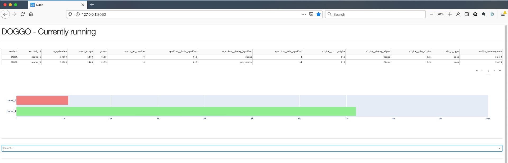
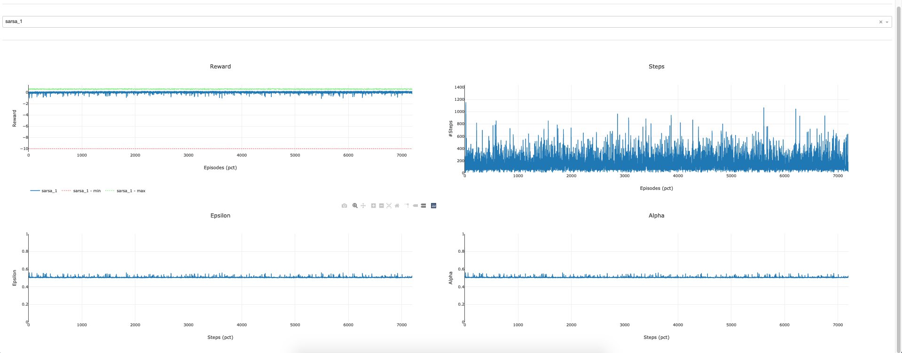
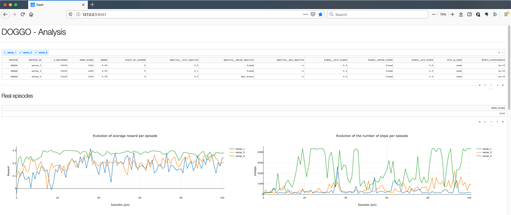
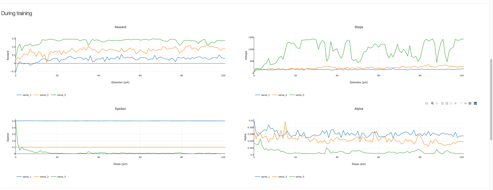
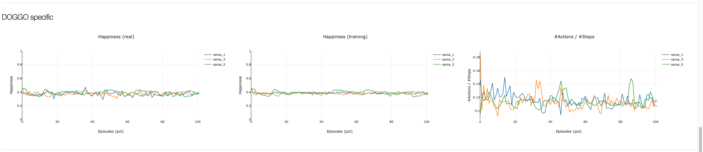

# DOGGO

Reinforcement Learning to make a Doggo immortal.

## What is a Doggo?

Doggo is first a project by [Romaric Thiam](https://github.com/RTH00). Remember tamagotchi? Doggo are similar. It is a digital pet, which one has to take care of by taking some actions, otherwise the Doggo will die.

A Doggo is represented by 3 characteristics:

* Food
* Fat
* Affection

All of these charactesristics are between 0 and 1 and help to determine the happiness of the Doggo:

$$happiness = min(food, 1-fat, affection)$$

Once the happiness reaches 0, the Doggo dies.

Food and affection will diminish in time. In my test, it decreases by a value of 0.01 every minute. Fat doesn't change with time. However, action can be taken to improve the levels of food and affection, or reduce fat.

## Reinforcement Learning

The primary goal of this project is to be able to make Doggos immortal. We want to find a modelthat will take the correct action to ensure that the Doggo will continue to live forever, with no restrictions on the number of actions.

(Note: later, I want to optimize the number of actions taken by the model, and optimize a long period without actions).

### State - Action - Reward

#### State

A state is define as the combination of:

* the 3 characteristics (food, fat, affection)
* a boolean, whether an action can be taken

#### Action

3 actions are possible: feeding, playing and walking. Feeding will affect positively the food, and negatively the fat ; Playing and walking will affect positively the fat and the affection.

|            |       | Effect on |           | Duration before effect | 
| :--------- | :---: | :-------: | :-------: | ---------------------: | 
| **Action** | Food  | Fat       | Affection |                        | 
| feed       | +25   | +25       | 0         | 1                      | 
| play       | 0     | -12       | +5        | 4                      | 
| feed       | 0     | -20       | +40       | 15                     | 

It is important to notice that, even though walking has a greater effect on the characteristics, it takes a longer time to have an effect. Taking your Doggo for a walk when it only has 5 minutes left to live will have no effect at all.

#### Reward

As a reward, we conside the happiness of the new state (therefore between 0 and 1). A (negative) reward of -10 is applied of the Doggo dies.

### Implemented technics

* [Monte Carlo](src/models/value_based/monte_carlo/README.md)
* [SARSA](src/models/value_based/sarsa/README.md)
* [Q-Learning](src/models/value_based/qlearning/README.md)
* [Double Q-Learning](src/models/value_based/doubleqlearning/README.md)

## How to use it

### Launch a test

~~~python
train_model_MonteCarlo.py [-h] [--render_episode [RENDER_EPISODE]]
	                            [--run_episode RUN_EPISODE]
	                            [--update_episode_division {0,1,5,10,20,50}]
	                            [--play_music [PLAY_MUSIC]]
	                            method_id
~~~

* render_episode: render information about every episode (in log)
* [run_episode: run an full-exploitation episode every X percent]
* update\_episode\_division: save Q and plot intermediate results every X percent
* play the spam song when finished
* method\_id: name of the config file under src/models/value_based/sarsa/config

~~~python
python -m src.models.value_based.monte_carlo.train_model_MonteCarlo monte_carlo_every_time_test --render_episode --run_episode 10 --update_episode_division 10 --play_music
~~~

~~~python
python -m src.models.value_based.monte_carlo.train_model_MonteCarlo monte_carlo_first_time_test --render_episode --run_episode 10 --update_episode_division 10 --play_music
~~~

#### Configuration file

~~~json
{
  "method": "monte_carlo_every_visit"
  , "method_MC": "every_visit"
  , "epsilon": {
    "init_epsilon": 1
    , "decay_epsilon": "per_state"
    , "min_epsilon": 0
  }
  , "alpha": {
    "init_alpha": 0.5
    , "decay_alpha": "fixed"
    , "min_alpha": 0.5
  }
  , "init_Q_type": "ones"
  , "n_episodes": 10000
  , "nmax_steps": 1440
  , "gamma": 0.95
  , "start_at_random": false
  , "KLdiv_convergence": 1e-10
}
~~~

* method: name of the method
* method\_MC: "every\_visit" or "first\_visit", method used for Monte Carlo
* epsilon:
	* init\_epsilon: initialisation value of epsilon
	* decay\_epsilon: "fixed", "per\_state", "per\_episode"
	* min\_epsilon: minimum epsilon possible. Careful when used with fixed, it still has an impact
* alpha
	* init\_alpha: initialisation value of alpha (between 0 and 1)
	* decay\_alpha: "fixed", "per\_state", "per\_episode"
	* min\_alpha: minimum alpha possible. Careful when used with fixed, it still has an impact
* init\_Q\_type: all Q-values are initiated with:
	* if "ones": 1
	* if "zeros": 0
	* if "random": random values between 0 and 1
	* if "optimum": the maximum reward possible over the episode
* n/_episodes: number of episodes to be run in this test
* nmax\_steps: number of steps per episode to be run in this test
* gamma: gamma-value
* start\_at\_random: 
	* if False, every episode starts with 0.50 of food, 0.00 of fat, 0.50 of affection, and action cane be taken (this is similar to the real initial state of a Doggo and is always used in full-exploitation episode)
	* if True, every episode starts with random values for the 3 characteristics, and action can be taken 
* [KLdiv_convergence: non-implemented yet]

## [Visualize current process](../../../../src/visualization/README.md)

It is possible to follow the evolution of the current process through the app "app\_currently\_running".

~~~
python3 src/visualization/app_currently_running.py
~~~
~~~
http://127.0.0.1:8052/
~~~

The first part shows all the tests currently running.

In the second part, by selecting a test, different evolutions of parameters are displayed.

## [Analysis](../../../../src/visualization/README.md)

Different scripts can be used for analysis. However, I recommend the app "app\_analysis".
One can select multiple tests to be compared (in the following examples, 3 tests are selected).

The 1st part will compare the parameters of the tests, as well as the evolution of rewad and steps for full-exploitation episodes along the training.

The 2nd part will compare the evolution of reward, number of steps, epsilon and alpha for episodes used during the training.

The rest will be specific to the Doggo project. First, it compares happiness and number of actions taken.

Then, a test in particular has to be selected to display more information, like the evolution of the characteristics of the Doggo along the training, the cause of deaths or the last full-exploitation episode.

Example 1                  |  Example 2                |  Example 3
:-------------------------:|:-------------------------:|:-------------------------:
.png)   |  .png)|  .png)

--------
