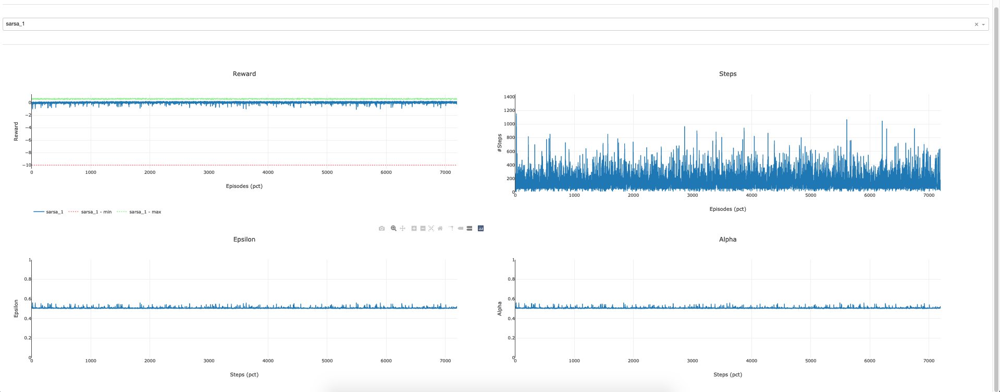
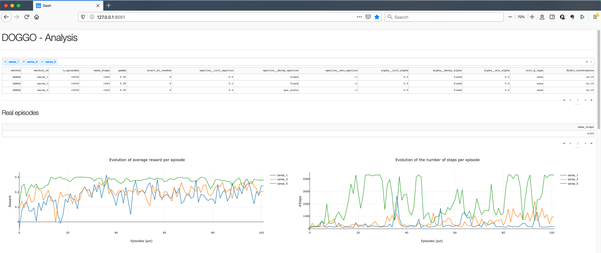
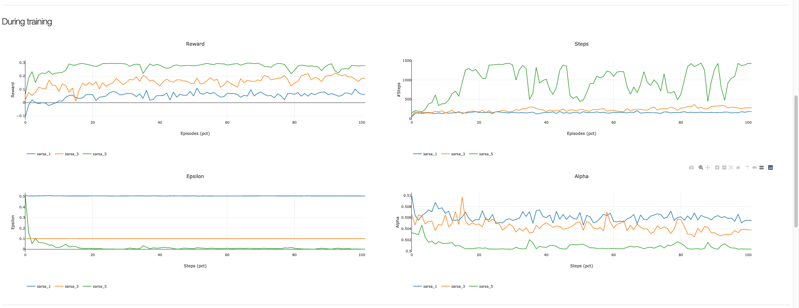
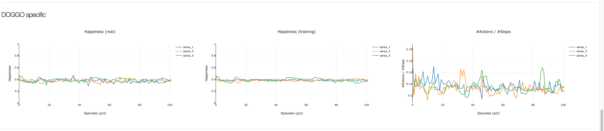

# DOGGO

Different tools for visualisation can be used.

* [Currently running tests](#currently-running-tests)
* [Analysis](#analysis)

## Currently running tests

It is possible to follow the evolution of the current process through the app "app\_currently\_running".

~~~
python3 src/visualization/app_currently_running.py
~~~
~~~
http://127.0.0.1:8052/
~~~

The first part shows all the tests currently running.

In the second part, by selecting a test, different evolutions of parameters are displayed.

## Analysis

Different scripts can be used for analysis. However, I recommend the app "app\_analysis".
One can select multiple tests to be compared (in the following examples, 3 tests are selected).

~~~
python3 src/visualization/app_analysis.py
~~~
~~~
http://127.0.0.1:8051/
~~~

The 1st part will compare the parameters of the tests, as well as the evolution of rewad and steps for full-exploitation episodes along the training.

The 2nd part will compare the evolution of reward, number of steps, epsilon and alpha for episodes used during the training.

The rest will be specific to the Doggo project. First, it compares happiness and number of actions taken.

Then, a test in particular has to be selected to display more information, like the evolution of the characteristics of the Doggo along the training, the cause of deaths or the last full-exploitation episode.

Example 1                  |  Example 2                |  Example 3
:-------------------------:|:-------------------------:|:-------------------------:
.png)   |  .png)|  .png)

--------
